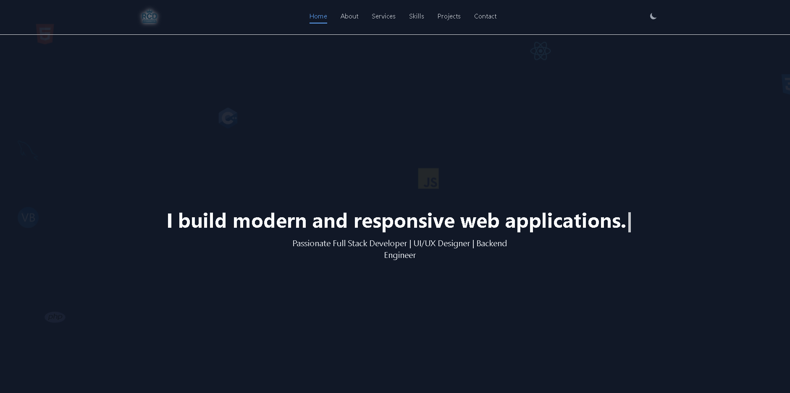

# Personal Portfolio Website

This repository contains the source code for the personal portfolio of Romer Casper Demeterio, a full-stack developer. This is a fully responsive, single-page website designed to showcase his skills, services, and projects to potential clients and employers.

 <!-- Replace with your live demo link -->

 <!-- Replace with a path to a screenshot of your site -->

## ✨ Features

-   **Fully Responsive Design**: Adapts seamlessly to all screen sizes, from mobile phones to desktop monitors.
-   **Dark/Light Theme Toggle**: Users can switch between a dark and a light theme, with their preference saved in local storage for future visits.
-   **Interactive UI Elements**:
    -   **Typing Effect**: An eye-catching typing animation in the hero section.
    -   **Image Carousel**: An auto-playing carousel in the "About Me" section to display multiple images.
    -   **Floating Logos**: Animated background with floating programming language logos for a dynamic feel.
    -   **Hover Effects**: Subtle hover animations on navigation links, cards, and buttons.
-   **Smooth Scrolling**: Clean navigation with smooth scrolling to different sections of the page.
-   **Dynamic Contact Modal**: An "Inquire Now" button on service and project cards opens a pre-filled contact modal, making it easy for users to get in touch. The modal provides options to send a pre-formatted email or contact via Facebook.
-   **Mobile-Friendly Navigation**: A collapsible hamburger menu for easy navigation on smaller devices.

## 🛠️ Technologies Used

This project was built using a combination of modern web technologies:

-   **Frontend**:
    -   **HTML5**: For the structure and semantic markup of the website.
    -   **CSS3**: For custom styling, animations (like the floating logos), and the theme-switching mechanism.
    -   **JavaScript (Vanilla)**: For all client-side interactivity, including the theme toggle, mobile menu, image carousel, typing effect, and the dynamic contact modal.

-   **Styling**:
    -   **Tailwind CSS**: A utility-first CSS framework for rapidly building the responsive layout and components.

-   **Icons**:
    -   **Devicon**: Used for the programming language and technology logos in the skills section and floating background.

## 📁 Project Structure

The project follows a simple and organized file structure:

## 👤 Contact

**Romer Casper Demeterio**

-   **Email**: [romercasper63@gmail.com](mailto:romercasper63@gmail.com)
-   **Facebook**: [Romer.BNS](https://www.facebook.com/Romer.BNS)

## 📄 License

This project is licensed under the MIT License. See the `LICENSE` file for more details.
